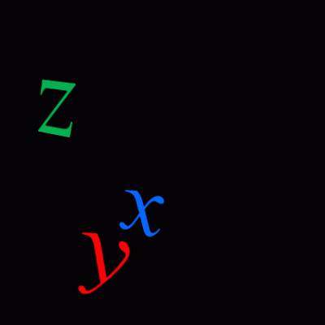
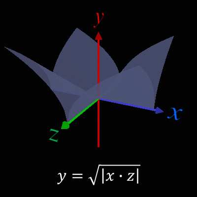
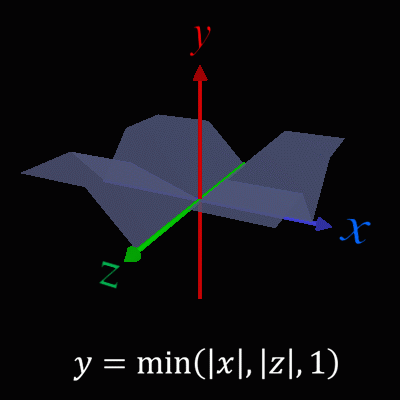
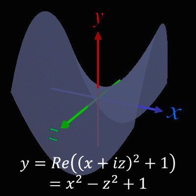
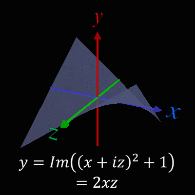

<html lang="ja">
    <head>
        <meta charset="utf-8" />
    </head>
    <body>
        <h1>
Translucent 3D Graph
</h1>
        <h2>なにものか？</h2>
        

            半透明の3Dグラフを表示するプログラムです。 
            
        

        <h2>環境構築方法</h2>
        

            pip install opencv-python PyOpenGL glfw 
        

        <h2>使い方</h2>
        

            ① 引数なし:　python 3dgrpah.py 
            "equation.txt" で指定されたf(x,z)の3Dグラフを表示します 
             
            ② 引数で式を記述したファイルを指定：　python 3dgrpah.py (equation text file) 
            引数で指定したテキストファイル内で指定された f(x,z)の3Dグラフを表示します 
             
            ③ 引数で式を指定：python 3dgrpah.py (f(x,z)の式) 
            例) python 3dgrpah.py np.sqrt(np.abs(x) * np.abs(z)) 
             
            python continuous_shooting.py (開始角度(0)) (終了角度(360))　(角度ステップ(5)) 
            3Dグラフを連写してscreenshot_****.png に出力します。 
            式は「equation.txt」で指定します。 
             
            python images_to_gif.py (画像群へのワイルドカード) (fps) (繰り返し回数) 
            例) python images_to_gif.py screenshot*.png 10 0 
            結果は output.gif に出力されます。 
            繰り返し回数に 0 を指定すると無限に繰り返します
        

            <table border="1">
                <tr><th>操作</th><th>機能</th></tr>
                <tr><td>左ボタン押下＋ドラッグ</td><td>3Dモデルの回転(yaw,pitch)</td></tr>
                <tr><td>矢印キー押下</td><td>(同上)</td></tr>
                <tr><td>rキー押下＋ホイール回転</td><td>3Dモデルの回転(roll)</td></tr>
                <tr><td>右ボタン押下＋ドラッグ</td><td>3Dモデルの移動</td></tr>
                <tr><td>ホイール回転</td><td>3Dモデルの拡大・縮小</td></tr>
                <tr><td>Xキー押下</td><td>x 方向の範囲を広げる</td></tr>
                <tr><td>xキー押下</td><td>x 方向の範囲を狭める</td></tr>
                <tr><td>Zキー押下</td><td>z 方向の範囲を広げる</td></tr>
                <tr><td>zキー押下</td><td>z 方向の範囲を狭める</td></tr>
                <tr><td>Yキー押下</td><td>y 方向の倍率を上げる</td></tr>
                <tr><td>yキー押下</td><td>y 方向の倍率を下げる</td></tr>
                <tr><td>－キー押下</td><td>y 方向の倍率を－1倍する</td></tr>
                <tr><td>aキー押下</td><td>座標軸の表示、非表示をトグル</td></tr>
                <tr><td>ホイールボタン押下</td><td>慣性モードのトグル(on⇔off)</td></tr>
                <tr><td>iキー押下</td><td>(同上)</td></tr>
                <tr><td>sキー押下</td><td>スクリーンショット保存</td></tr>
                <tr><td>ESCキー押下　</td><td>プログラム終了</td></tr>
                <tr><td>ウィンドウ閉じるボタン押下　</td><td>プログラム終了</td></tr>
            </table>
        

                おまけ：座標軸ラベルのみ表示すると･･･ 
                python axis-label.py 
                
        

        <h2>使用例</h2>
        <h3>直交するV字谷(1)</h3>
        

             
            1点で偏微分可能でも全微分可能にならない例。 
            x軸、z軸上ではy=0 → (x,z)=(0,0) では ∂y/∂x=0, ∂y/∂z=0 
            しかし、軸以外の方向には微分不可。
        

        <h3>直交するV字谷(2)</h3>
        

             
            1点で偏微分可能でも全微分可能にならない例。 
            x軸、z軸上ではy=0 → (x,z)=(0,0) では ∂y/∂x=0, ∂y/∂z=0 
            しかし、軸以外の方向には微分不可。
        

        <h3>y=x2+1の定義域、値域を複素数に拡張した場合の関数値の実数部</h3>
        

             
            x軸上では下に凸。常に0より大きい。 
            z軸上では上に凸。2点で0になる。 
        

        <h3>y=x2+1の定義域、値域を複素数に拡張した場合の関数値の虚数部</h3>
        

             
            x軸上、z軸上で0になる。 
        

    </body>
</html>
