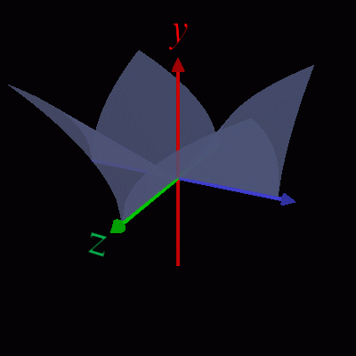

<html lang="ja">
    <head>
        <meta charset="utf-8" />
    </head>
    <body>
        <h1>
Translucent 3D Graph
</h1>
        <h2>なにものか？</h2>
        

            半透明の3Dグラフを表示するプログラムです。 
            
        

        <h2>環境構築方法</h2>
        

            pip install opencv-python PyOpenGL glfw 
        

        <h2>使い方</h2>
        

            python translucent3dgrpah.py 
             
            defineSurface 関数で y＝f(x,y) を指定します。 
            <table border="1">
                <tr><th>操作</th><th>機能</th></tr>
                <tr><td>左ボタン押下＋ドラッグ</td><td>3Dモデルの回転(yaw,pitch)</td></tr>
                <tr><td>矢印キー押下</td><td>(同上)</td></tr>
                <tr><td>rキー押下＋ホイール回転</td><td>3Dモデルの回転(roll)</td></tr>
                <tr><td>右ボタン押下＋ドラッグ</td><td>3Dモデルの移動</td></tr>
                <tr><td>ホイール回転</td><td>3Dモデルの拡大・縮小</td></tr>
                <tr><td>Yキー押下</td><td>y方向の倍率を上げる</td></tr>
                <tr><td>yキー押下</td><td>y方向の倍率を下げる</td></tr>
                <tr><td>－キー押下</td><td>y方向の倍率を－1倍する</td></tr>
                <tr><td>ホイールボタン押下</td><td>慣性モードのトグル(on⇔off)</td></tr>
                <tr><td>iキー押下</td><td>(同上)</td></tr>
                <tr><td>sキー押下</td><td>スクリーンショット保存</td></tr>
                <tr><td>ウィンドウ閉じるボタン押下　</td><td>プログラム終了</td></tr>
            </table>
        

    </body>
</html>
